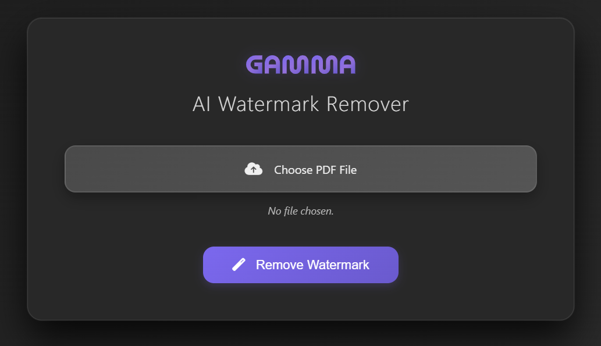

# 🌌✨ Gamma AI Watermark Remover — Clean PDFs in Seconds ✨

<div align="center">
  
  
  
  
</div>

<br/>

<div align="center">
  <strong>⚠️ Educational Use Only — Respect Gamma’s Terms ⚠️</strong>
</div>

---

# 🎨 Interface Preview

<div align="center">
  <!-- Replace the link below with your actual interface screenshot -->
  
</div>

---

# 🖼️ Before & After Comparison

<table align="center">
  <tr>
    <td align="center"><strong>🔻 With Watermark</strong></td>
    <td align="center"><strong>🔺 Without Watermark</strong></td>
  </tr>
  <tr>
    <!-- Replace these two images with your actual before/after samples -->
    <td></td>
    <td></td>
  </tr>
</table>

---

# 🌟 What Is Gamma AI Watermark Remover?

A fast and intelligent web tool that **removes Gamma.app watermarks** from exported PDFs — giving you clean, professional-quality documents suitable for:

- 📚 Students  
- 👨‍🏫 Educators  
- 💼 Professionals  
- 🎨 Designers & Creators  

No more Gamma branding on your important work.

---

# 🎯 Why People Use It

### ❌ Gamma Free Tier Adds Watermarks  
### ✔ You Need Clean PDFs For:

- College submissions  
- Business meetings  
- Study materials  
- Pitch decks  
- Corporate documents  
- Client deliverables  
- Portfolio work  

This tool ensures your PDF looks **polished and brand-free**.

---

# ⚙️ How It Works

### 🔍 1. Parse  
Reads the PDF using **PyMuPDF (fitz)**  

### 🧠 2. Detect  
Identifies Gamma watermarks by:  
- Position (bottom-right)  
- Images  
- Embedded links to `https://gamma.app`  

### ✂️ 3. Remove  
Cleans only the watermark layers while preserving layout.

### 📄 4. Export  
Outputs a **clean, watermark-free PDF**.

---

# 🚀 Installation & Setup

### 1️⃣ Clone the Repository
```bash
git clone https://github.com/yourusername/gamma-watermark-remover.git
cd gamma-watermark-remover
2️⃣ Install Dependencies
pip install -r requirements.txt

3️⃣ Start Server
python app.py

4️⃣ Open in Browser
http://localhost:8000

5️⃣ Upload → Remove Watermark → Download

✔ Fast
✔ Private
✔ No data stored

🛠 Tech Stack
Layer	Technology
Backend	FastAPI
PDF Engine	PyMuPDF
Runtime	Python 3.8+
Server	Uvicorn
UI	HTML, CSS, JS
Deployment	Render
✨ Features

🚀 Super fast watermark removal

🔒 No file storage — privacy friendly

📱 Works on all devices

🎯 Removes both image + hyperlink watermarks

🧽 Clean, modern UI

🔄 Supports all Gamma-exported PDFs

🧩 Future Enhancements

Multiple PDF batch cleaning

REST API for automation

Drag-and-drop animated interface

Dark mode

AI-based watermark detection

🔒 Disclaimer

This tool is strictly for educational purposes only.
You are responsible for ensuring compliance with Gamma's Terms of Use.

⭐ Support the Project

If this helped you:
✔ Star ⭐ the repo
✔ Share it
✔ Contribute via PR

